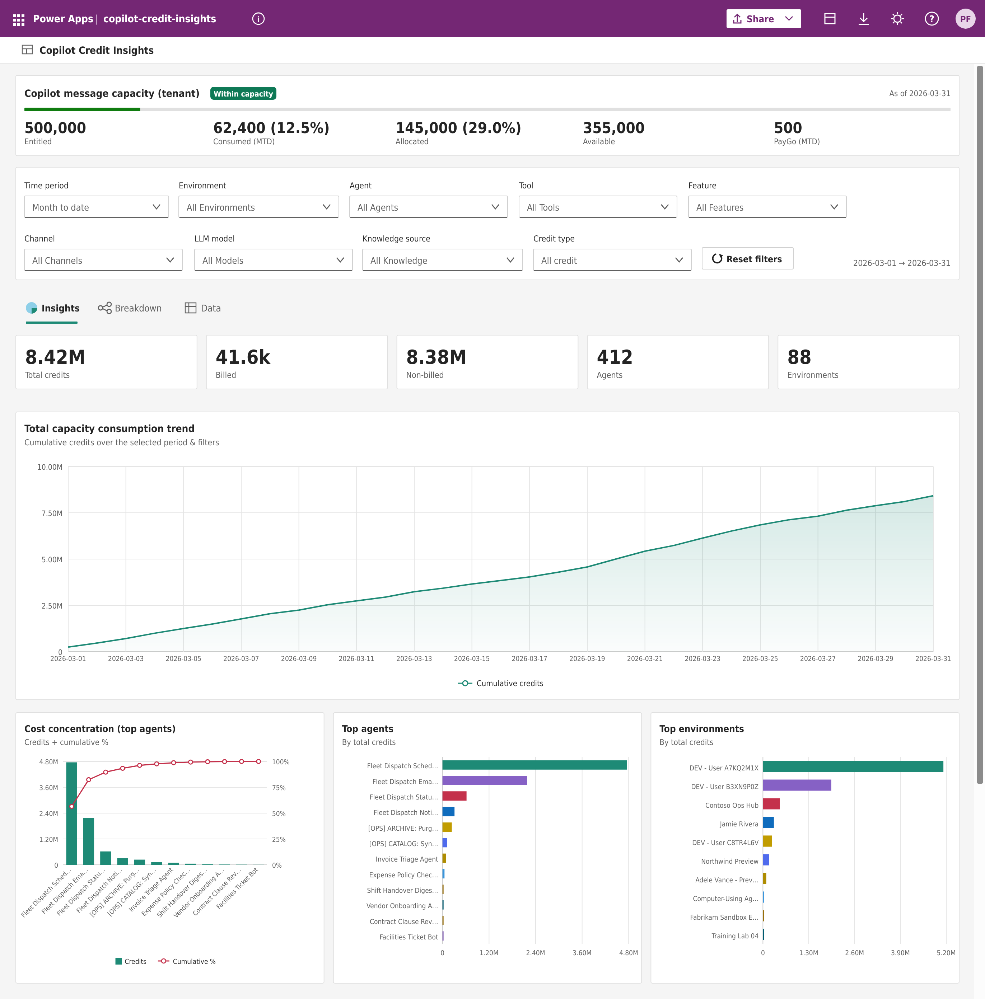

# 💳 Copilot Credit Consumption

Track Microsoft Copilot Studio message‑credit consumption across your tenant — a daily
Power Automate flow stores per‑agent usage in Dataverse, surfaced in a Power Apps
**Code App** dashboard.

## 🎯 Why use it?

The Power Platform admin center already shows Copilot Studio consumption, but you can't
reshape those reports or build your own views on top of them. This solution gives you both:

- **Own your licensing data — build any dashboard.** A cloud flow writes tenant‑wide
  Copilot consumption **into Dataverse every day**, giving you a durable, granular
  history in tables you control. Point Power BI, Excel, or any app at them and build
  exactly the views your admins need — chargeback by environment, agent‑level cost
  tracking, capacity‑vs‑entitlement trends, and more.
- **Richer insights out of the box.** The included **Power Apps Code App** surfaces more
  than the standard admin‑center reports — tenant capacity, billed vs non‑billed credits,
  top agents and environments, consumption trends, and a filterable data grid — ready the
  moment the first sync finishes (pictured above).

## 🏗️ How it works

`Licensing API → daily cloud flow → Dataverse tables → Code App dashboard`

- **Sync** — a Power Automate flow runs at 03:00 UTC and writes one row per agent per day
  into `cat_agentdetail` (7‑day self‑healing overlap; 180‑day backfill on first run) plus
  a capacity snapshot into `cat_tenantcapacity`. It reads consumption from the Power
  Platform licensing API and environment names from the BAP API.
- **App** — a React + Fluent UI v9 Code App reads the Dataverse tables and renders
  insights, breakdowns, and a data grid.

## 📋 Prerequisites

- A **Power Platform environment with Dataverse** and permission to import solutions
  (**System Administrator**).
- A **tenant admin** account (Global, Power Platform, or Billing) to authorize the
  licensing connection — reading tenant‑wide consumption requires admin scope.
- **Power Apps code apps** enabled for the environment (PPAC → Environment →
  **Settings → Product → Features**).
- Copilot Studio usage in the tenant — with none, the dashboard still loads and shows zeros.

## 🚀 Deploy

Download the solution from the **[latest release](https://github.com/PetrosFeleskouras/copilot-credit-consumption/releases/latest)** —
`CopilotCreditConsumption_managed.zip` (recommended; clean install/uninstall) or
`CopilotCreditConsumption.zip` (unmanaged, if you want to customize it).

1. **Enable Code Apps** — PPAC → your environment →
   **Settings → Product → Features → Power Apps code apps → On** (propagation can take a
   few minutes).
2. **Import the solution** — in [make.powerapps.com](https://make.powerapps.com) →
   **Solutions → Import solution** → upload the zip. *(CLI alternative:
   `pac solution import --path CopilotCreditConsumption_managed.zip --publish-changes`.)*
   This creates the tables, the `Credit Insights Reader` role, the flow (imported **off**),
   the Code App, and four unbound connection references.
3. **Bind the four connections** (see the table below).
4. **Turn on the flow** — enable *Copilot Credit Consumption - Daily* and **Run** it once.
   **Wait for this first run to finish before opening the app** — the 180-day backfill can
   take 10-20 minutes, and the dashboard stays empty until it completes. (The trigger is a
   singleton, so extra runs just queue; watch progress in **Run history**.)
5. **Open & share the app** — open *copilot-credit-insights* from **Apps**. To give others
   read access, **share the app** and assign the **Credit Insights Reader** role.

**The four connections** — bind each in the solution's **Connection references** (or open
the flow, which prompts for each):

| Connection reference | Connector | Base Resource URL / Entra ID resource URI |
|---|---|---|
| `ccsync_dvref` | Microsoft Dataverse | *(just sign in — no URL)* |
| `ccsync_webref` | HTTP with Microsoft Entra ID | `https://licensing.powerplatform.microsoft.com` |
| `ccsync_bapref` | HTTP with Microsoft Entra ID | `https://api.powerplatform.com` |
| `ccsync_dvhttpref` | HTTP with Microsoft Entra ID | your org URL, e.g. `https://YOUR-ORG.crm.dynamics.com` |

For the three *HTTP with Microsoft Entra ID* connections, enter the URL in **both** the
*Base Resource URL* and *Microsoft Entra ID resource URI* fields. The account authorizing
`ccsync_webref` must be a **tenant admin**. Find your org URL in
[make.powerapps.com](https://make.powerapps.com) → **⚙ Settings → Session details →
Instance url**.

**Updating later** — re‑import a newer solution zip; connection bindings and existing data
are preserved (turn the flow back **On** if the import deactivates it).

## 🔧 Troubleshooting

| Symptom | Where to look / fix |
|---|---|
| **Dashboard is empty after import** | The flow hasn't finished its first run yet. Confirm it's **On** with a **successful** run, then refresh the app. The first run can take 10-20 minutes (180‑day backfill). |
| **Flow run failed** | Open the flow → **Run history** → the failed run. Most failures are an **unbound/expired connection** (re‑authorize it) or the authorizing account **lacking tenant‑admin scope** for the licensing API. |
| **Quick status** | Query `cat_syncmetadata` — `cat_lastsyncstatus` (Success / Failed / Running), `cat_lastsyncmessage`, and `cat_lastsyncedat` summarize the last run. |
| **Flow off after an update** | A re‑import can deactivate the flow — turn it back **On**. Bindings and data are preserved. |
| **App won't open / "code apps not enabled"** | Enable **Power Apps code apps** in PPAC (step 1); propagation can take a few minutes. |

## 🧩 Data model

Everything lives in three Dataverse tables — build your own Power BI reports or dashboards
directly on them.

**`cat_agentdetail`** — one row per agent per day (the main fact table):

| Column | Type | Meaning |
|---|---|---|
| `cat_reportdate` | DateTime | Usage day (UTC midnight). |
| `cat_lookbackdays` | Integer | Aggregation window; `1` = a daily row. |
| `cat_agentid` / `cat_agentname` | String | Agent id and display name. |
| `cat_environmentid` / `cat_environmentname` | String | Environment id and display name. |
| `cat_billedcredit` / `cat_nonbilledcredit` | Decimal | Billed and non‑billed message credits. |
| `cat_users` | Integer | Distinct users for the agent that day. |
| `cat_feature`, `cat_tool`, `cat_llmmodel`, `cat_channel`, `cat_knowledgesources`, `cat_product` | String | Usage breakdown dimensions. |
| `cat_rowkey` | String | Composite key used to de‑duplicate a day's rows. |

**`cat_tenantcapacity`** — a capacity snapshot written each run: `cat_capacitytype`,
`cat_asofdate` / `cat_capturedon` (DateTime), and the decimals `cat_entitled`,
`cat_allocated`, `cat_consumed`, `cat_available`, `cat_paygoconsumed`, plus
`cat_unit` / `cat_status`.

**`cat_syncmetadata`** — a single housekeeping row: `cat_lastsyncstatus`
(Choice: Success / Failed / Running), `cat_lastsyncmessage`, `cat_lastsyncedat`.

> **Retention** — rows accumulate indefinitely (the flow only self‑heals the last 7 days).
> To cap growth, add a Dataverse bulk‑delete on `cat_reportdate`.

## 🧱 Repository layout

| Path | Purpose |
|---|---|
| [`solution-export-full/`](solution-export-full/) | The importable solution (managed + unmanaged zips). **Start here.** |
| `codeapp/` | Power Apps Code App source (React / Vite / Fluent UI v9). |
| `solution-allinone/` | Source for the daily cloud flow. |
| `docs/` | Security requirements. |

##  Security

See [docs/security-requirements.md](docs/security-requirements.md) for the minimum
roles/licenses to install, run the sync (tenant admin + Dataverse write), and view the app
(`Credit Insights Reader` role).

## ⚠️ Disclaimer

This is a community sample, **not** a Microsoft product and not affiliated with or endorsed
by Microsoft. It reads the Power Platform licensing / entitlements API, which is **not an
officially documented or supported API** and may change without notice. Provided **as‑is**
under the MIT license — review it against your organization's policies before deploying.

## 📄 License

[MIT](LICENSE) © 2026 Copilot Credit Consumption contributors.
